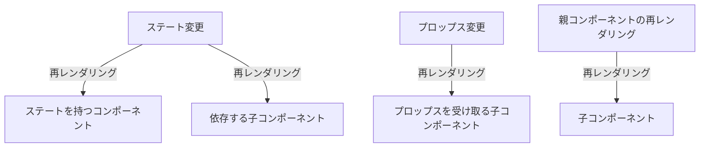

## 再レンダリングの仕組みを知り、再レンダリングを最適化

### 再レンダリングが起きる条件３つ

- state が更新されたコンポーネントは再レンダリングされる。
- props が変更されたコンポーネントは再レンダリングされる。
- 再レンダリングされたコンポーネント配下の子要素は再レンダリングされる。
  - 「例」A ＞ B ＞ C
  - B コンポーネントでの変更があると C コンポーネントも再レンダリングされる。

<details><summary>図解：Mermaid記法を使用</summary>



</details>

### レンダリング最適化１(memo)：コンポーネントのメモ化

- React における「メモ化（memoization）」とは、レンダリングの結果をメモリに保存しておき、次回以降同じ入力があった場合に保存された結果を再利用するという最適化手法の一つ。
- メモ化は「React.memo()」関数を通じて実現され、特にプロップスが変更されない限り、再レンダリングを抑制しパフォーマンスを改善する。

<details><summary>サンプルコード</summary>

```js
import { memo } from "react";

const ChildArea = memo((props) => {
  const { open, onClickClose } = props;
});
```

</details>

### レンダリング最適化２(useCallback)：関数のメモ化

- `useCallback`フックはメモ化されたコールバック関数を返す。これは、依存性配列の値が変更されたときだけ新たな関数を作成する。
- `useCallback`を使うことで、依存性(`setOpen`)が変更されない限り、同じコールバック関数が使用され続けるため、不必要な子コンポーネントの再レンダリングを防ぐことができる。

<details><summary>サンプルコード</summary>

```js
import { useCallback } from "react";

const onClickClose = useCallback(() => setOpen(false), [setOpen]);

return (
  <div className="App">
    <input value={text} onChange={onChangeText} />
    <br />
    <br />
    <button onClick={onClickOpen}>表示</button>
    <ChildArea open={open} onClickClose={onClickClose} />
  </div>
);
```

</details>

### おまけ(useMemo)：変数のメモ化

- `useMemo`のフックは、依存配列のいずれかの値が変わったときだけメモ化された値を再計算することで、不必要な計算を避けることができる。
- `useMemo`は、再計算のコストが問題となる場合に限り、適切に使用した方がよいかも。

<details><summary>サンプルコード</summary>

```js
// 例１
const temp = useMemo(() => 1 + 3, []);

// 例２
var a = 0;
var b = 0;

// 計算コストが高い関数、aとbはその関数が依存している変数
// 依存配列の値が変更されたときだけ、再レンダリングされる。
const memoizedValue = useMemo(() => computeExpensiveValue(a, b), [a, b]);
```

</details>
