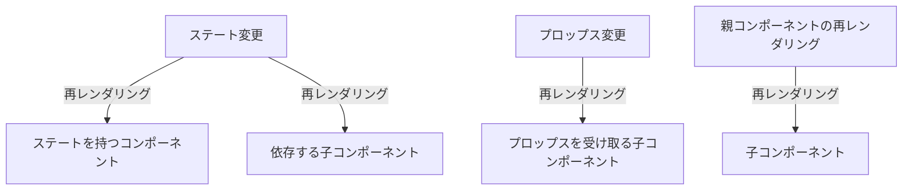

## 再レンダリングの仕組みを知り、再レンダリングを最適化

### 再レンダリングが起きる条件３つ

- state が更新されたコンポーネントは再レンダリングされる。
- props が変更されたコンポーネントは再レンダリングされる。
- 再レンダリングされたコンポーネント配下の子要素は再レンダリングされる。
  - 「例」A ＞ B ＞ C
  - B コンポーネントでの変更があると C コンポーネントも再レンダリングされる。

<details><summary>図解：Mermaid記法を使用</summary>



</details>

### レンダリング最適化１(memo)：コンポーネントのメモ化

- React における「メモ化（memoization）」とは、レンダリングの結果をメモリに保存しておき、次回以降同じ入力があった場合に保存された結果を再利用するという最適化手法の一つ。
- メモ化は「React.memo()」関数を通じて実現され、特にプロップスが変更されない限り、再レンダリングを抑制しパフォーマンスを改善する。

<details><summary>サンプルコード</summary>

```js
import { memo } from "react";

const ChildArea = memo((props) => {
  const { open, onClickClose } = props;
});
```

</details>

### レンダリング最適化２(useCallback)：関数のメモ化

### おまけ(useMemo)：変数のメモ化
