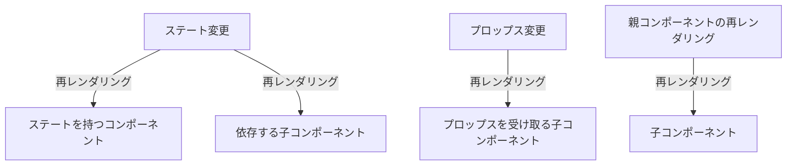

## 再レンダリングの仕組みを知り、再レンダリングを最適化

### 再レンダリングが起きる条件３つ

- state が更新されたコンポーネントは再レンダリングされる。
- props が変更されたコンポーネントは再レンダリングされる。
- 再レンダリングされたコンポーネント配下の子要素は再レンダリングされる。
  - 「例」A ＞ B ＞ C
  - B コンポーネントでの変更があると C コンポーネントも再レンダリングされる。

図解：Mermaid記法を使用

### レンダリング最適化１(memo)：コンポーネントのメモ化

### レンダリング最適化２(useCallback)：関数のメモ化

### おまけ(useMemo)：変数のメモ化
